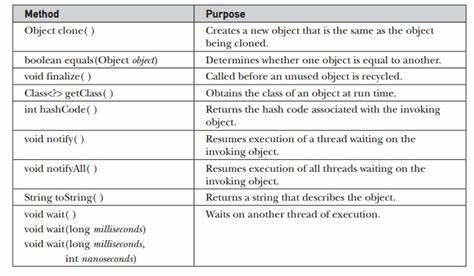
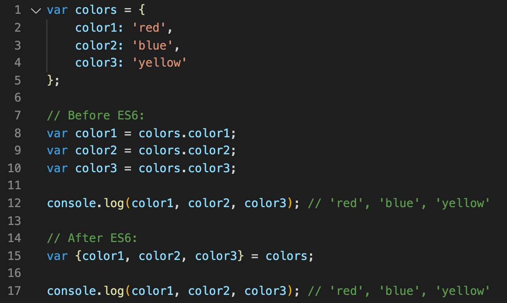

# ___Object in JavaScript___
*Object* - очень похож на массив, но вызвать его можно не индексом как в массиве, а с помошью *key*, то есть ключа или можно сказать названия. *Object* также может может брать любой тип, хоть число, хоть текст, он даже внутри создать ещё один *object*.

Чтобы его создать нужно открыть скобки ( { } ), затем внутри написать ключи, то есть их название и написать значение этого ключа. 

.jpg>)

# ___Methods Object___
*Methods keys()* - это матод который аозволяет нам вложить все ключи или названия в один массив. *Methods values()* имеет те же свойства что и *methods keys()*, но берёт в один массив знвчения ключей, а также есть *methods entries()* который имеет свойство обеих методов, то есть он берёт в массив кажный ключ с его знвчением и встовляет в один большой, можно сказать что он паказывает массивы в массиве. Существует множество методов, но эти являются одними из основных.

# __Destructuring и Spread в object___
Их свойства такие же как и в массиве, но немного отличаются. *Destructuring* работает по таким же принципам как и в массиве, то есть значения ключей делает переменными, но вызвать его нужно не с помощью индексов как в массиве, а с помощью ключей, то есть ключи работают как индексы в массиве. *Spread* работает также как и в массиве, но после копировки выводит ключь и его значение в массиве.

